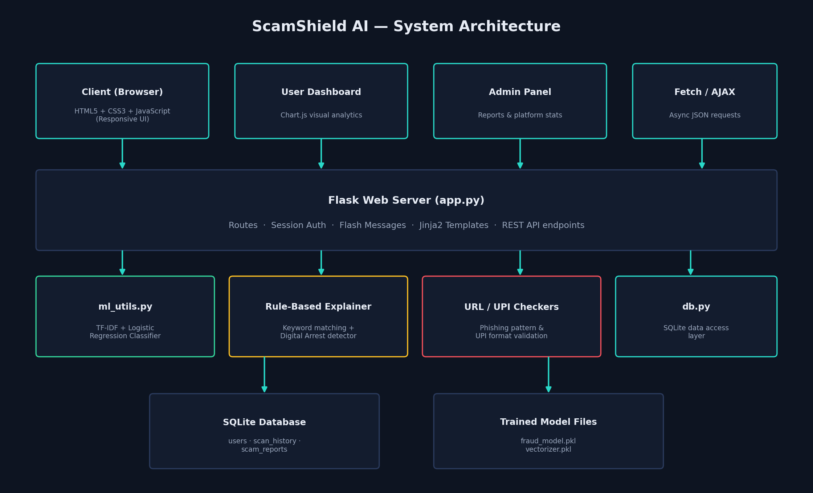
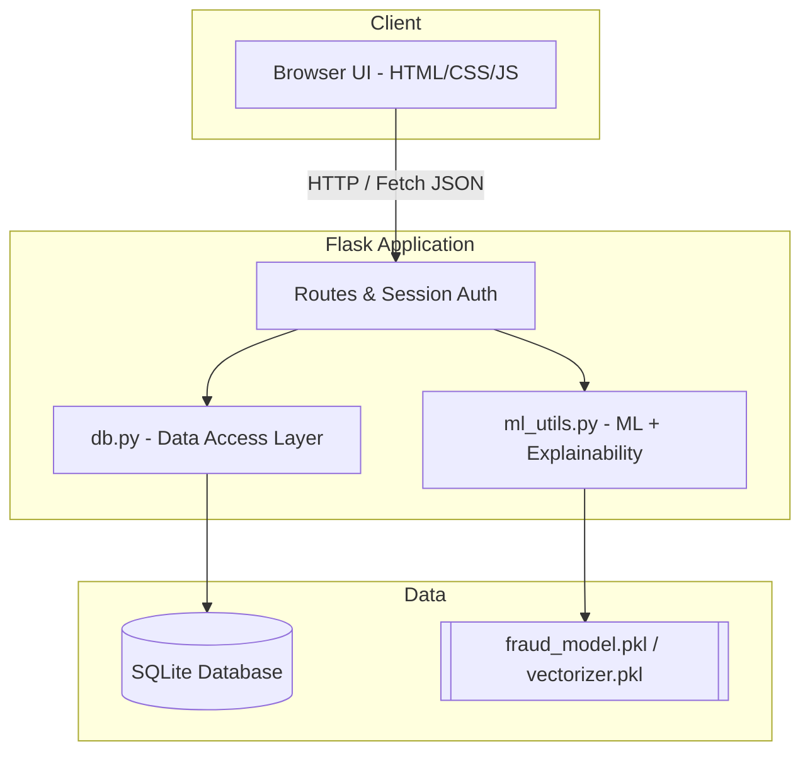
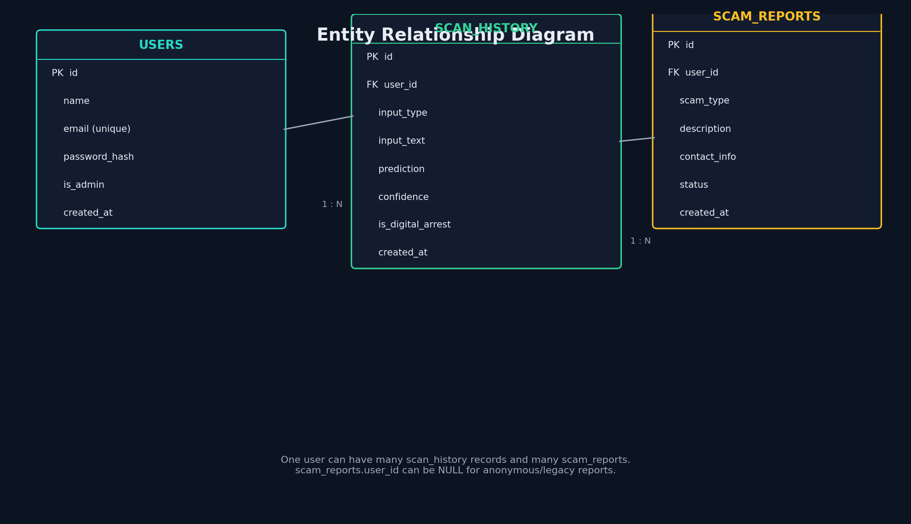
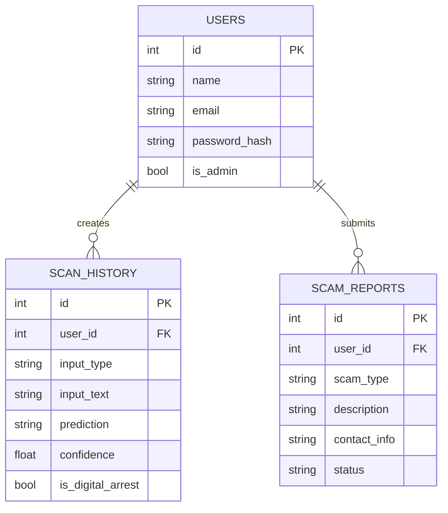

# 🛡 ScamShield AI

**AI for Digital Public Safety — Defeating Counterfeiting, Fraud & Digital Arrest Scams**
Economic Times AI Hackathon 2.0 — Phase 2 — Problem Statement PS6

ScamShield AI is a full-stack web application that uses a trained Machine
Learning model plus an explainable rule-based layer to classify SMS, emails,
website URLs, and UPI IDs as **Safe**, **Suspicious**, or **Fraud** — with a
plain-English explanation and prevention tips for every verdict. It also
includes a dedicated detector for India's fast-growing **Digital Arrest**
scam, a scam-reporting module, and an admin panel.

---

## 📌 Table of Contents

1. [Features](#-features)
2. [Tech Stack](#-tech-stack)
3. [Project Structure](#-project-structure)
4. [System Architecture](#-system-architecture)
5. [Running This on GitHub](#-running-this-on-github)
6. [Installation Guide](#-installation-guide)
7. [How the AI Works](#-how-the-ai-works)
8. [Database Schema (ER Diagram)](#-database-schema)
9. [API Documentation](#-api-documentation)
10. [Default Accounts](#-default-accounts)
11. [Future Scope](#-future-scope)

---

## ✨ Features

| Module | Description |
|---|---|
| 🔐 User Auth | Registration & login (session-based, password hashing via Werkzeug) |
| 🏠 Home Page | Product overview, feature highlights, how-it-works section |
| ✉ Fraud Detector | Classifies SMS / Email / URL text as Safe / Suspicious / Fraud |
| 🚨 Digital Arrest Detector | Specialised detector for fake police/CBI video-call arrest scams |
| 📱 UPI & QR Awareness | Validates UPI ID format + educates on QR/UPI scam patterns |
| 📢 Scam Reporting | Users can report scams they encounter |
| 💡 Safety Tips | Curated, AI-informed prevention guidance |
| 📊 Dashboard | Personal scan history + Chart.js visual breakdown |
| 🛡 Admin Panel | View & triage all community scam reports, platform stats |

Every AI verdict includes:
- **Prediction**: Safe / Suspicious / Fraud
- **Confidence score**
- **Explanation**: exactly which red flags were detected
- **Prevention tips**: what to do next

---

## 🧰 Tech Stack

- **Backend:** Python, Flask
- **Frontend:** HTML5, CSS3 (custom design system), Vanilla JavaScript, Chart.js
- **AI / ML:** scikit-learn (TF-IDF Vectorizer + Logistic Regression), rule-based explainability layer
- **Database:** SQLite (zero-config, default) — MySQL schema provided as an optional upgrade
- **Auth:** Flask sessions + Werkzeug password hashing

---

## 📁 Project Structure

```
scamshield-ai/
├── app.py                     # Main Flask application (routes + API)
├── requirements.txt
├── README.md
├── models/
│   ├── dataset.csv            # Sample labeled training data
│   ├── train_model.py         # ML training script
│   ├── fraud_model.pkl        # Trained Logistic Regression model
│   ├── vectorizer.pkl         # Fitted TF-IDF vectorizer
│   └── model_report.txt       # Accuracy / classification report
├── utils/
│   ├── db.py                  # SQLite database access layer
│   └── ml_utils.py            # Prediction + explainability logic
├── database/
│   └── schema_mysql.sql        # Optional MySQL schema
├── templates/                  # Jinja2 HTML templates
│   ├── base.html, index.html, login.html, register.html,
│   ├── dashboard.html, detect.html, digital_arrest.html,
│   ├── upi_qr.html, report.html, safety_tips.html, admin.html
├── static/
│   ├── css/style.css
│   └── js/ (main.js, detect.js, digital_arrest.js, upi_qr.js)
└── docs/
    ├── generate_diagrams.py    # Script that generated the diagrams below
    ├── API_DOCUMENTATION.md
    └── diagrams/ (architecture, workflow, ER diagram PNGs)
```

---

## 🏗 System Architecture





---

## 🐙 Running This on GitHub

GitHub itself only *hosts* code — to actually run the app you either clone it
locally, or use **GitHub Codespaces**, which spins up a free cloud dev
environment and runs it for you inside the browser. This repo is
pre-configured for both.

### Option A — Push to GitHub (for judges to view/clone your code)

```bash
cd scamshield-ai
git init
git add .
git commit -m "Initial commit: ScamShield AI - PS6 Hackathon Project"
git branch -M main
git remote add origin https://github.com/<your-username>/scamshield-ai.git
git push -u origin main
```

> Don't have a repo yet? Go to [github.com/new](https://github.com/new),
> create an empty repository named `scamshield-ai` (do **not** initialize it
> with a README), then run the commands above.

### Option B — Run it live in GitHub Codespaces (no local setup at all)

This repo includes a `.devcontainer/devcontainer.json`, so once it's pushed:

1. Open your repo on GitHub.
2. Click the green **Code** button → **Codespaces** tab → **Create codespace on main**.
3. Wait ~30–60 seconds — dependencies install automatically and `python app.py` starts.
4. When port `5000` is forwarded, click **Open in Browser** (or the pop-up notification) to see the live app.

This is the easiest way for hackathon judges to try your app without installing anything.

### Option C — Clone and run locally

```bash
git clone https://github.com/<your-username>/scamshield-ai.git
cd scamshield-ai
pip install -r requirements.txt
python app.py
```
Then open `http://127.0.0.1:5000`.

### Tips for a strong GitHub submission
- Add a short repo **description** and topics like `hackathon`, `flask`, `machine-learning`, `fraud-detection`.
- Replace this README's placeholder `<your-username>` links once your repo is live.
- Consider recording your demo video (see `docs/DEMO_VIDEO_SCRIPT.md`) and linking it at the top of this README.
- The `.gitignore` already excludes `database/scamshield.db` and `__pycache__/`, so your repo stays clean — the SQLite DB is recreated automatically on first run.

---


### Prerequisites
- Python 3.10+
- pip

### Step-by-step

```bash
# 1. Clone or unzip the project
cd scamshield-ai

# 2. (Recommended) create a virtual environment
python -m venv venv
source venv/bin/activate        # On Windows: venv\Scripts\activate

# 3. Install dependencies
pip install -r requirements.txt

# 4. Train the AI model (generates models/fraud_model.pkl + vectorizer.pkl)
cd models
python train_model.py
cd ..

# 5. Run the Flask app (SQLite DB + admin account are auto-created on first run)
python app.py

# 6. Open your browser
http://127.0.0.1:5000
```

> ⚠️ The `fraud_model.pkl` and `vectorizer.pkl` files are already included in
> `models/`, so step 4 is optional unless you want to retrain on your own data.

### Switching to MySQL (optional)
1. Import `database/schema_mysql.sql` into your MySQL server.
2. Install a MySQL driver: `pip install pymysql`
3. Update the connection logic in `utils/db.py` to use PyMySQL instead of `sqlite3`.

---

## 🤖 How the AI Works

1. **TF-IDF Vectorization** — converts input text into numeric features
   based on word/phrase importance (unigrams + bigrams).
2. **Logistic Regression Classifier** — trained on a labeled dataset of
   real-world-style SMS/email samples (`models/dataset.csv`) to predict
   `safe`, `suspicious`, or `fraud`.
3. **Rule-Based Explainability Layer** — a curated keyword bank (lottery,
   KYC, OTP, "digital arrest", etc.) is matched against the input to build
   a transparent, human-readable explanation of *why* a verdict was given.
4. **Digital Arrest Safety Override** — if 2+ Digital-Arrest-specific
   keywords are found (e.g. "CBI officer", "stay on video call"), the
   system force-classifies the input as **Fraud** regardless of the raw ML
   score, since under-flagging this scam type carries serious real-world risk.
5. **URL Checker** — a separate lightweight rule engine flags phishing
   indicators: raw IP URLs, suspicious TLDs (`.tk`/`.ml`/`.ga`/`.cf`), URL
   shorteners, brand-name spoofing, and reward/urgency keywords in the path.
6. **UPI ID Checker** — validates UPI ID format (`name@bank`) and flags
   lottery/prize/cashback-themed IDs.

See `docs/diagrams/workflow_diagram.png` for the full request pipeline.

---

## 🗄 Database Schema





---

## 📡 API Documentation

Full request/response examples are in [`docs/API_DOCUMENTATION.md`](docs/API_DOCUMENTATION.md).

| Endpoint | Method | Auth | Description |
|---|---|---|---|
| `/api/detect` | POST | Login required | Classify SMS/Email/URL text |
| `/api/check-upi` | POST | Login required | Validate a UPI ID |
| `/api/dashboard-data` | GET | Login required | Get current user's scan stats |
| `/admin/update-status/<id>` | POST | Admin only | Update a scam report's status |

---

## 🔑 Default Accounts

| Role | Email | Password |
|---|---|---|
| Admin (seeded automatically) | `admin@scamshield.ai` | `Admin@123` |
| Regular User | Register your own via `/register` | — |

---

## 🔭 Future Scope

- Deep learning (LSTM/BERT) model for higher accuracy on larger real-world datasets
- Real QR code image upload + decode (OpenCV/pyzbar) for live QR scanning
- Integration with National Cyber Crime Reporting Portal API
- Browser extension for real-time link scanning
- SMS gateway integration for direct on-device scanning
- Multi-language support (Hindi, Telugu, and other regional languages)

---

## 👤 Author

Built by a B.Tech CSE (Data Science) student for the Economic Times AI
Hackathon 2.0 — Phase 2, under Problem Statement PS6: *AI for Digital Public
Safety — Defeating Counterfeiting, Fraud & Digital Arrest Scams.*

